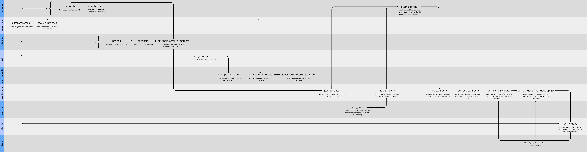

## SUMediPose dataset creation pipeline

This repo contains all code used to process the data to generate "SUMediPose: A 2D-3D Pose Estimation Dataset".

The pipeline is detailed in the image above.